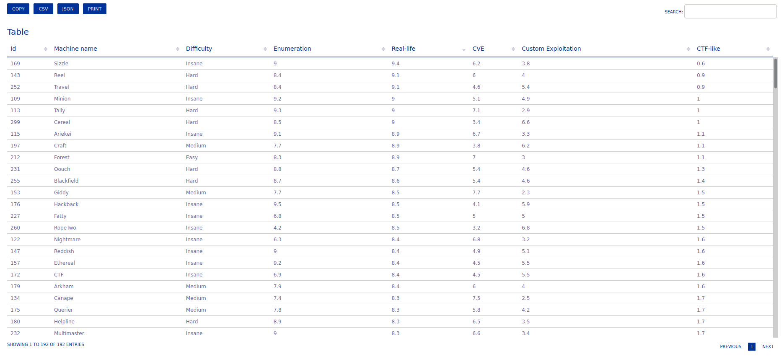

# Best HackTheBox Machines

## About

This repository contains a simple script that I use in order to download data from HackTheBox' API, which in turn is used to generate an HTML table containing various information regarding a machine (`Box`), e.g. `Name`, `Difficulty`, and more importantly the `Matrix`. The latter contains 5 scores (from 0 to 10):

- Enumeration
- Real-Life
- CVE
- Custom Exploitation
- CTF-like



## Why

At the time of writing, I didn't know any other methods to get the information I needed.

## Details

The script it's not very user-friendly. You have to:

- add your own `API_KEY` (either inside `main.py` or in a new file `secrets.py`)
- create the foldr `data/` (used to write `.csv` and `.json` files)
- change the functions called inside the `main`

```py
if __name__ == "__main__":
    write_data_all_machines()
    write_data_all_matrices()
    write_matrices_data_to_csv()
    write_matrices_data_to_csv(maker_or_aggregate='maker')
```

First you have to download data from the API, and then write it to file, which in turn is used to generate two `CSV` files.

After you get the aforementioned files, you can use the package [csvtotable](https://github.com/vividvilla/csvtotable) to generate the HTML ones.

```bash
# install package
pip3 install csvtotable

# generate HTML files
bash gen_html.sh

# open them
firefox data/*.html
```

P.S. Aggregate matrices are the ones generated by users submitting feedback.

Moreover, not every author submits a matrix when creating the machine, which means that you may not find a matrix in some cases.

After you have opened one of the two HTML files, you can sort the rows by `Real-life`, in order to get the names of the machines with the highest score for that attribute.
